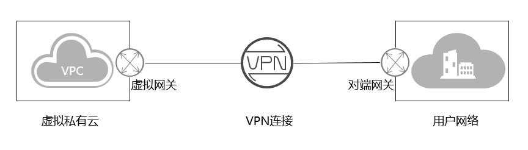

# 对端网关设备

VPN 连接将您的本地网络链接到您的 Virtual Private Cloud \(VPC\)。

本地网关是连接您本地网络的对接设备，它可以是物理或软件设备，控制台上创建的对端网关是云上虚拟对象，用于记录用户实体设备的配置信息。

VPN 连接中的云侧一端称为虚拟网关。

本地网络、对端网关设备、通往虚拟网关的 VPN 连接以及 VPC和虚拟网关的关系如下图所示。

在对端网关和虚拟专用网关之间可以有一条或者两条线路组成。如果您的网络与VPC互通对可用性要求高，建议使用两条线路，在云上创建两个或以上的连接，以便为 VPC 服务提供更高的可用性。如果一个隧道发生设备故障，您的 VPN 连接会自动故障转移到另一个隧道，防止您的访问中断。

