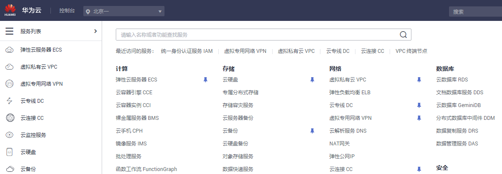
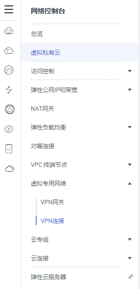
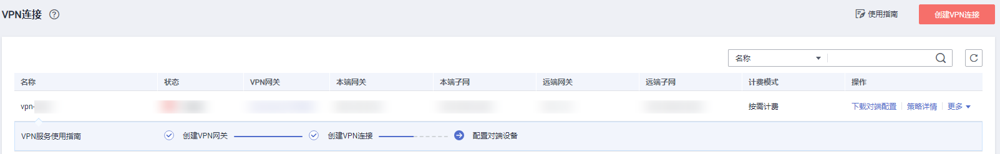

# 查看已创建的VPN连接

## 操作场景

用户申请VPN连接后，可以查看已申请的VPN连接。

## 操作步骤

1.  在管理控制台左上角单击图标，选择区域和项目。
2.  在系统首页，单击“网络 \> 虚拟专用网络”。

    

3.  在左侧导航栏选择“虚拟专用网络\> VPN连接”。

    

4.  在“VPN连接”页面的VPN连接列表中可以查看VPN连接。
5.  在VPN连接列表中，单击“操作”列的“策略详情”，查看该VPN连接对应的IKE策略和IPsec策略详情。

    

