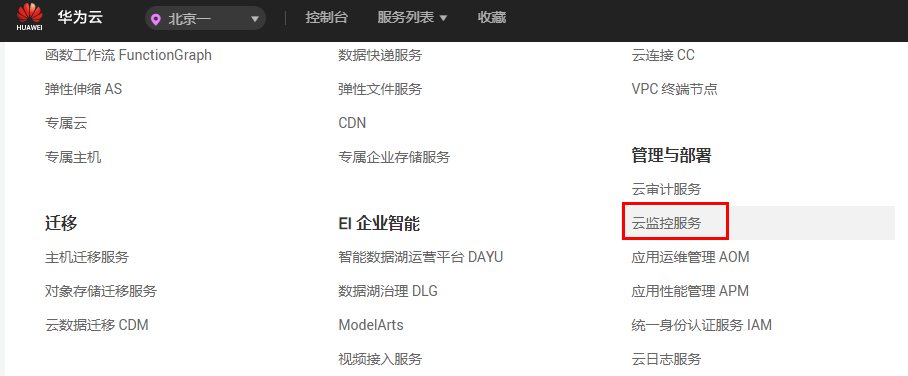
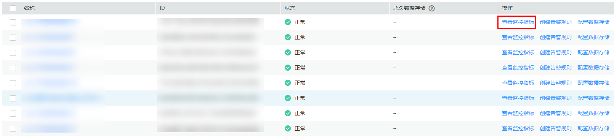
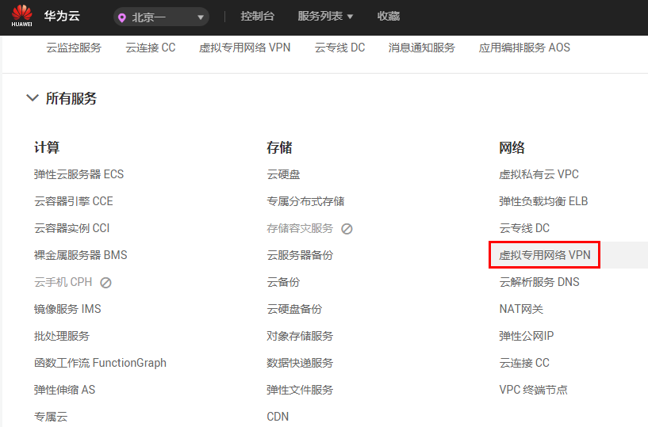
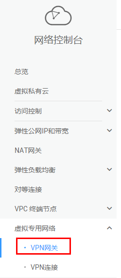

# 查看监控指标

## 操作场景

查看VPN连接状态、带宽、弹性公网IP的使用情况。

## 操作步骤

**查看VPN连接状态：**

1.  登录管理控制台。
2.  在管理控制台左上角单击，选择区域和项目。
3.  在系统首页，选择“管理与部署 \> 云监控服务”。

    

4.  单击页面左侧的“云服务监控”，选择“虚拟专用网络”。

    

5.  单击“操作”列的“查看监控指标”，查看VPN连接状态。

    支持查看“近1小时”、“近3小时”和“近12小时”的数据。

    

    > **说明：**   
    >用户也可以在登录管理控制台后，进入虚拟专用网络服务，单击“VPN连接”，在目标VPN连接所在行选择“操作＞更多＞查看监控”，查看VPN连接状态。  

**查看带宽或弹性公网IP**：

1.  登录管理控制台。
2.  在管理控制台左上角单击，选择区域和项目。
3.  在系统首页，选择“网络 \> 虚拟专用网络”。

    

4.  单击页面左侧的“VPN网关”。

    

5.  单击“操作”列的“查看监控”，查看带宽或弹性公网IP的监控指标详情。

    支持查看“近1小时”、“近3小时”和“近12小时”的数据。

    

